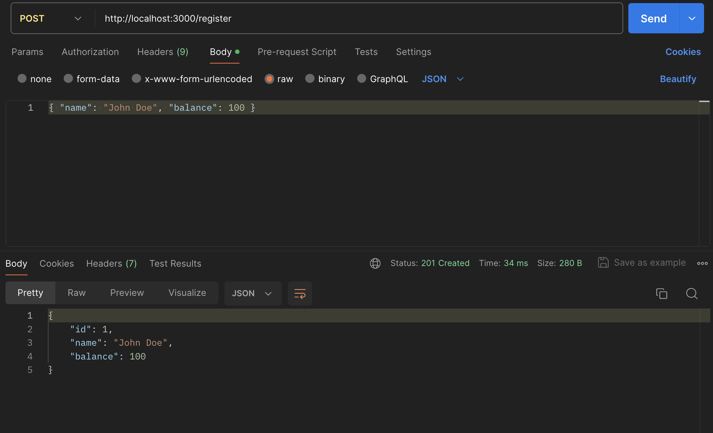
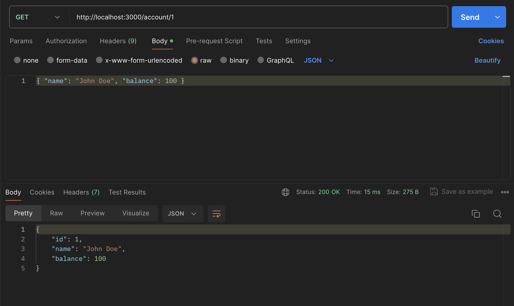
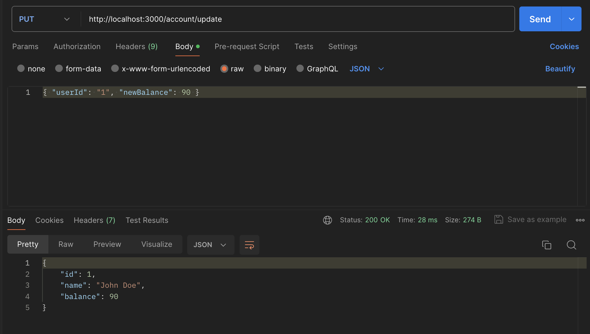
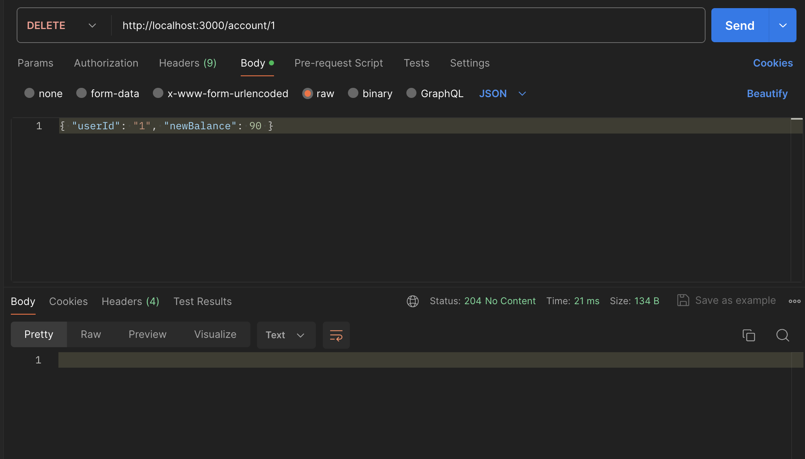
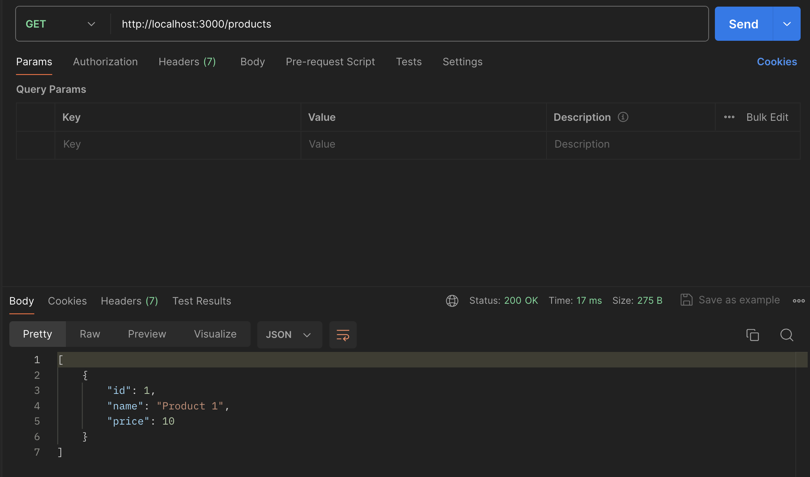
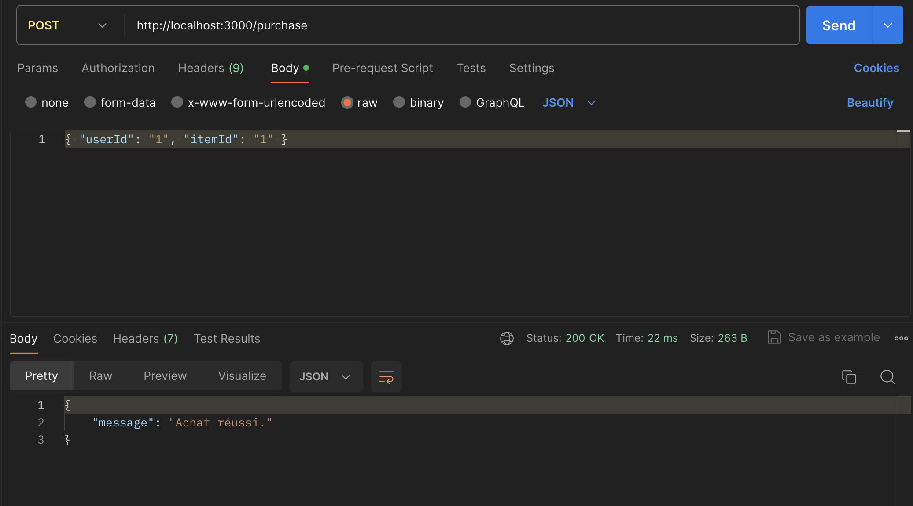
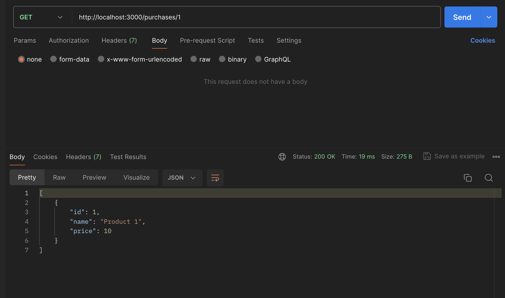

# Projet API d'achat

Ce projet est une API simple construite avec Node.js et Express. Il comprend deux services principaux : un service d'achat et un service de comptes.

## Fonctionnalités

### Service de comptes

- **Inscription** : Les  utilisateurs peuvent s'inscrire en fournissant leur nom et leur solde.
- **Récupération des informations du compte** : Permet de récupérer les informations d'un compte utilisateur, y compris le solde et l'historique des achats.
- **Mise à jour du compte** : Met à jour le solde du compte d'un utilisateur après un achat.
- **Suppression des données utilisateur** : Permet à un utilisateur de supprimer toutes ses informations.

## Installation

1. Clonez ce dépôt sur votre machine locale.
2. Naviguez jusqu'au répertoire du projet dans votre terminal.
3. Exécutez `npm install` pour installer les dépendances du projet.
4. Exécutez `node server.js` pour démarrer le serveur.

## Test

Vous pouvez tester l'API en utilisant  Postman.

## Accounts API

### Registration Endpoint

Users can register by providing their name and account balance. This data is then stored in memory.

- Method: POST
- Endpoint: /register
- Body: { "name": "John Doe", "balance": 100 }

### Account Info Retrieval Endpoint

Permet de récupérer les informations d'un compte utilisateur, y compris le solde et l'historique des achats.

- Method: GET
- Endpoint: /account/:userId

### Update Account Endpoint

Met à jour le solde du compte d'un utilisateur après un achat.

- Method: PUT
- Endpoint: /account/update
- Body: { "userId": "1", "newBalance": 90 }

### Delete User Data Endpoint

Permet à un utilisateur de supprimer toutes ses informations.

- Method: DELETE
- Endpoint: /account/:userId

## Purchases API

### Product List Endpoint

Affiche les produits disponibles à l'achat.

- Method: GET
- Endpoint: /products

### Purchase Item Endpoint

Permet aux utilisateurs d'acheter un produit en fournissant son ID. Valide le solde de l'utilisateur avant de procéder à l'achat.

- Method: POST
- Endpoint: /purchase
- Body: { "userId": "1", "itemId": "2" }

### Purchase History Endpoint

Affiche une liste des achats de l'utilisateur.

- Method: GET
- Endpoint: /purchases/:userId

